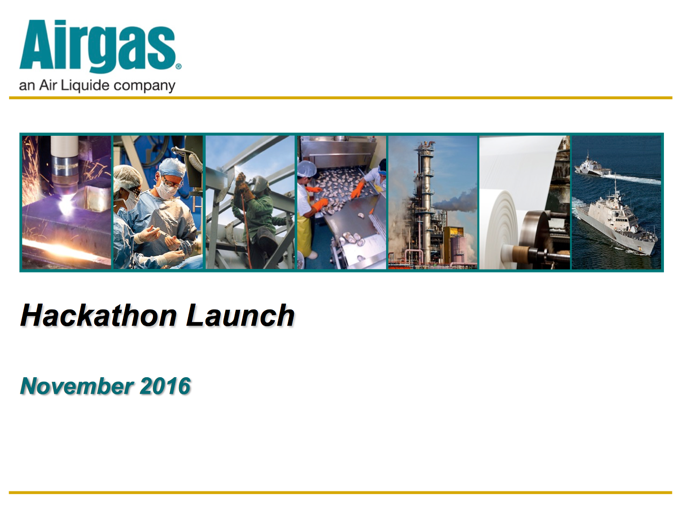
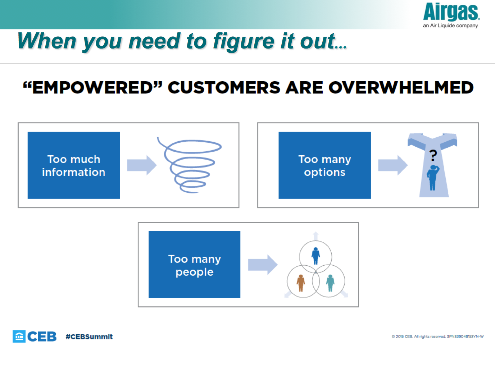
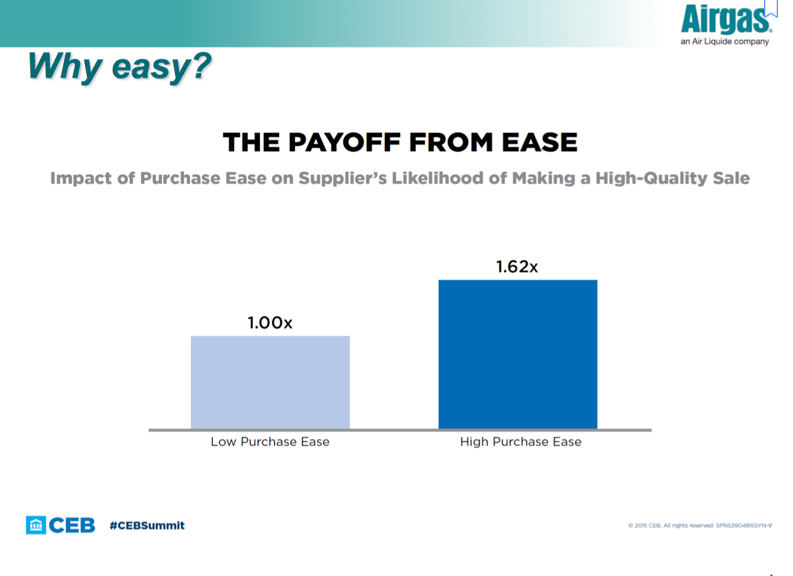
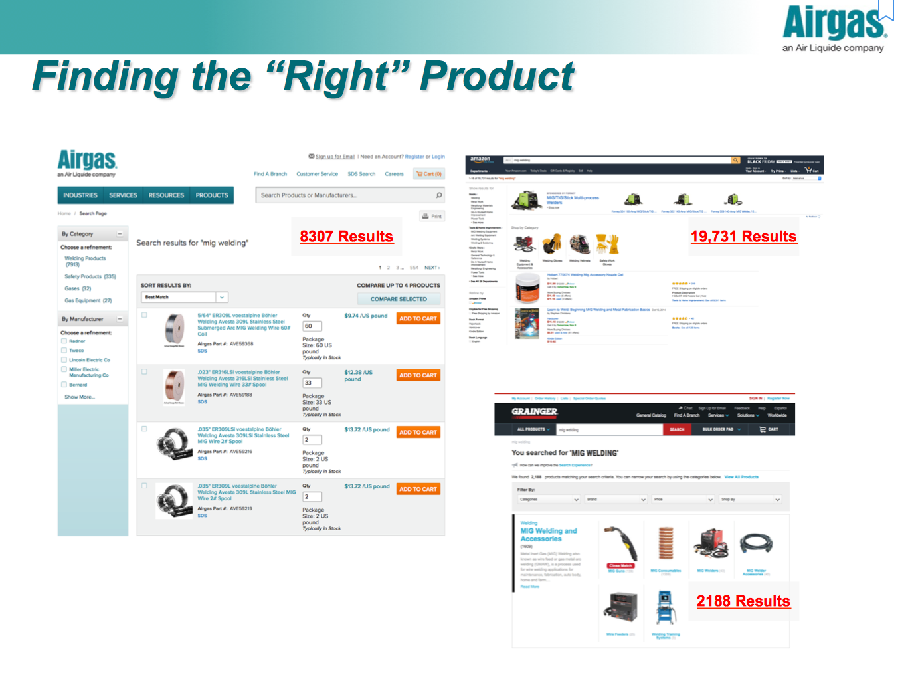
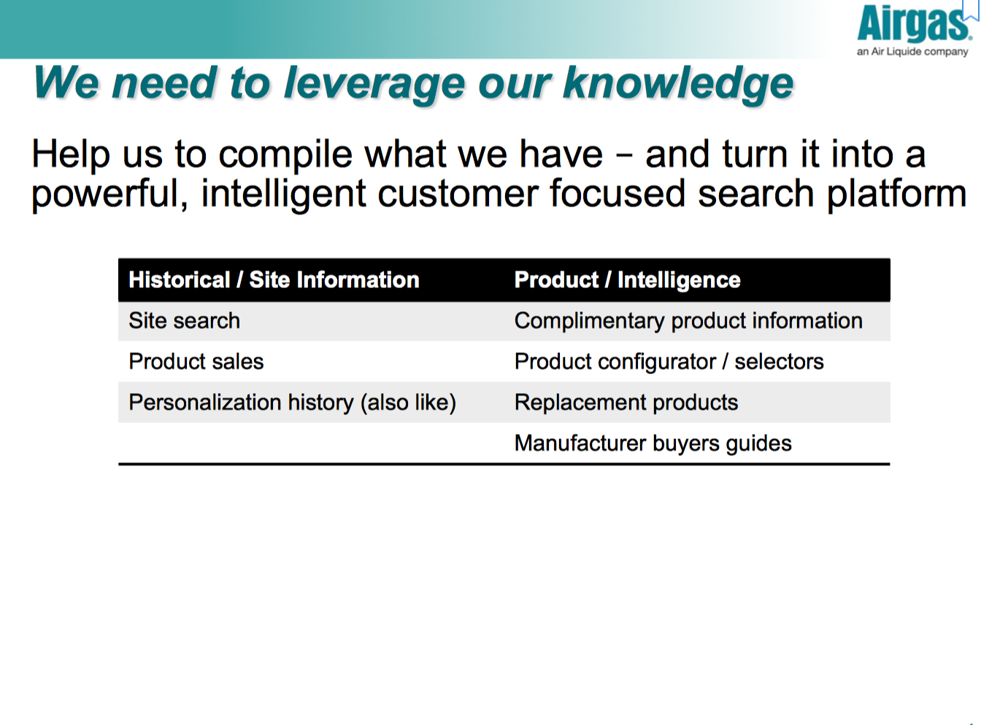
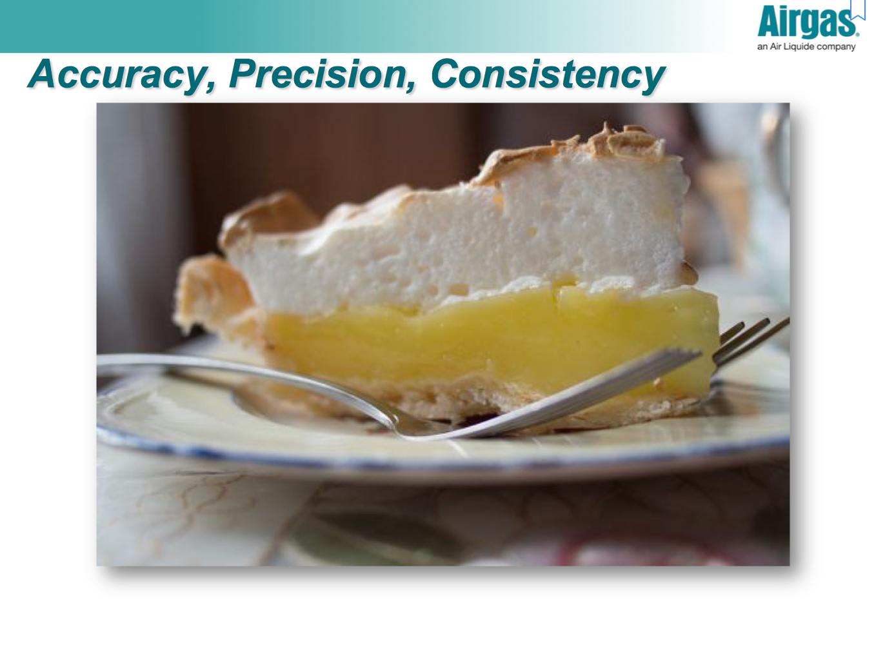

# Mar-rel
Mar-rel is a simple search engine for small startups

## Research Problem
* Improve value in challenging Product Search experience
* Created AI solution that translates user input into product database language
* Result is a product search experience that generates relevant results and reduces frustration 

## Introduction
To evaluate search relevancy, Lotus has had their team evaluate searches from Airgas. A total of 100 search terms were generated, and Lotus put together a list of products and their corresponding search terms. Each person in the team was asked to give a product search term a score of 1, 2, 3, 4, with 4 indicating the item completely satisfies the search query, and 1 indicating the item doesn't match the search term.

Although Airgas Inc. is the biggest online distributor of welding equipments in the states with a significant online turnover many small online businesses with little user activity on their ecommerce page have no effective way of evaluating the performance of the search engine solution they use. This makes it especially difficult for small team with little access to in-house technology staff to measure and improve on their customer experience. In case of Airgas Inc. more is better and can surely be handled easily!
The goal of the Relevance Engine is to create a model for Airgas that can be used to measure the relevance of search results.
In doing so, we'll be helping enable first-time visitors to better have their search results sorted out for them to match the experience provided by more resource rich competitors like Amazon.
This engine will also provide Airgas a model to test against. Given the queries and resulting product descriptions from their Google Ad campaign. This product will help Airgas to evaluate the accuracy of their search algorithms.

## Screenshots

